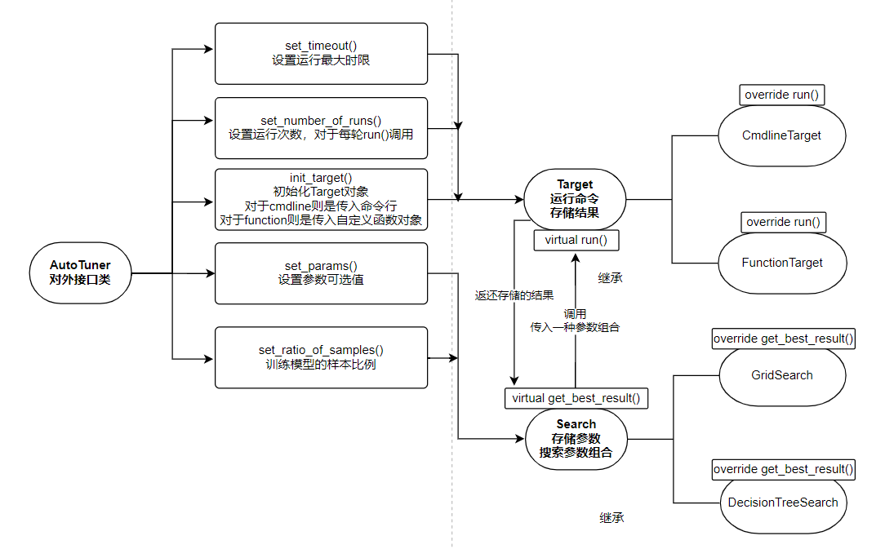
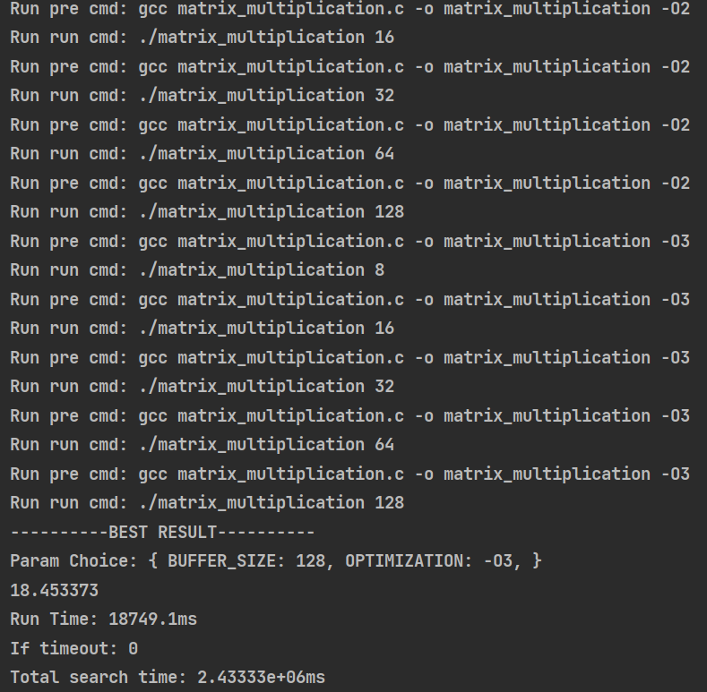
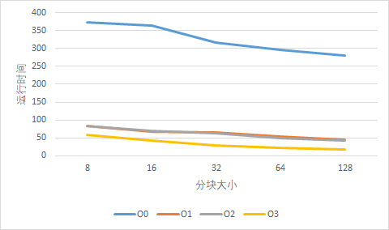
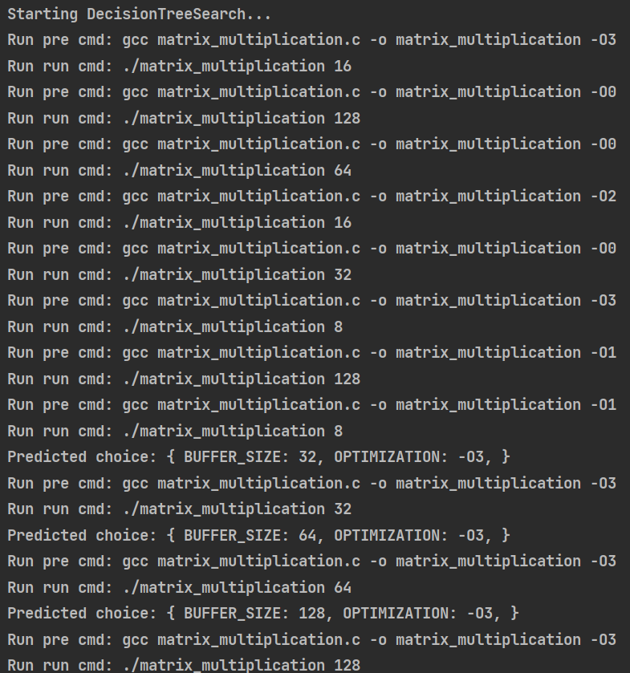
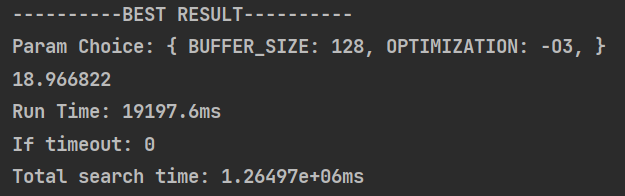

## 一、项目介绍

AutoTuner是一个由cpp编写的自动调参库，支持对命令行程序、cpp自定义函数的自动调参。

### 已实现功能

* 对命令行程序的调参 - `CmdlineTarget`
* 对自定义函数的调参 - `FunctionTarget`
* 网格搜索调参 - `Gridsearch`
* 决策树预测调参 - `DecisionTreeSearch`
* 设置不同的优化目标 - `MIN_RUNTIME, MIN_OUTPUT_DOUBLE, MAX_OUTPUT_DOUBLE`

### 测试环境

本项目使用`C23`标准，测试操作系统为`5.10.16.3-microsoft-standard-WSL2`

### 项目文件

```
.
├── CMakeLists.txt
├── README.md
├── bin - 二进制文件
├── doc - 文档
├── examples - 示例文件
├── include - 头文件
├── lib - 库文件
├── src - 源代码
├── test - 测试代码
└── third_party - mlpack库
```

### 编译

项目由`cmake`构建，依赖于机器学习库`mlpack`

如果需要构建库文件，需要先安装mlpack（对应仓库已给出安装方法）

[mlpack/mlpack: mlpack: a fast, header-only C++ machine learning library (github.com)](https://github.com/mlpack/mlpack)

测试部分使用`GoogleTest`

### 如何使用

由于仓库已上传动态库至`lib/shared`，所以直接链接即可

```cmake
add_library(auto_tuner_shared_release SHARED IMPORTED)
set_target_properties(auto_tuner_shared_release PROPERTIES IMPORTED_LOCATION ${CMAKE_LIBRARY_OUTPUT_DIRECTORY}/libauto_tuner_shared.so)

add_executable(example matrix_multiplication/example.cpp)
target_link_libraries(example auto_tuner_shared_release)
```

当然也可以根据需要自行编译动态库/静态库（确保mlpack的安装）

添加头文件，编译时链接库文件即可使用

```cpp
#include <auto_tuner.h>

int main() {
  tune::AutoTuner<tune::CmdlineTarget, tune::DecisionTreeSearch> auto_tuner{};
  ...
```

详细用法参见`examples/`

## 二、详细报告

## 1. 框架介绍

项目有关代码写于命名空间`tune`下

### 1.添加类型

参数值类型

```cpp
class ParamValue {
 public:
  explicit ParamValue(std::variant<int, double, char, std::string>&& v)
      : _p(std::forward<decltype(v)>(v)) {}
  [[nodiscard]] std::string to_string() const;
 private:
  std::variant<int, double, char, std::string> _p;
};
```

参数组合类型

```cpp
using ParamChoice = std::unordered_map<std::string, ParamValue>;
```

运行结果类型

```cpp
// 分别对应的是参数组合，程序输出，运行时间，是否超时
using RunResult = std::tuple<ParamChoice, std::string, double, bool>;
```

不同的优化目标

```cpp
// 分别对应最小化运行时间，最小化程序输出结果，最大化程序输出结果（转为double）
enum class Optimization { MIN_RUNTIME, MIN_OUTPUT_DOUBLE, MAX_OUTPUT_DOUBLE };
```

详见`include/common.h`

### 2.Target类

Target类负责运行目标程序以及存储结果，需要实现的虚函数定义为run，接受参数组合p和优化目标options，负责运行目标程序，并将运行结果存入_rs：

```cpp
virtual void run(const ParamChoice &p, Optimization options) = 0;
```

私有变量_rs负责存储运行结果：

```cpp
std::vector<RunResult> _rs;
```

函数`get_best_result()`根据优化目标返回_rs中最优结果：

```cpp
[[nodiscard]] const RunResult &get_best_result(Optimization options) const;
```

辅助私有变量

```cpp
// 超时限制
size_t _timeout = 0;
// 调用Run时的运行次数（结果取平均值）
size_t _num_of_runs = 1;
```

### 3.Search类

Search类负责设置参数，搜索参数组合并给出结果

设置参数（使用不定参数模板实现）：

```cpp
template <typename... Args>
void set_params(const std::string& key, Args&&... args)
```

搜索参数组合：

```cpp
virtual RunResult get_best_result(Target& target, Optimization options) = 0;
```

设置的参数组合存于私有变量：

```cpp
std::unordered_map<std::string, std::vector<ParamValue>> _params_spacing;
```

### 4.AutoTuner类

包装Target类与Search类，利用模板实现动态绑定

```cpp
template <typename T, typename S,
          typename = std::enable_if_t<std::is_base_of_v<Target, T> &&
                                      std::is_base_of_v<Search, S>>>
class AutoTuner {
```

私有变量存储对应的实例

```cpp
T target;
S search;
```

### 5.设计结构

项目的核心类为`Target`（调参对象）和`Search`（搜索方法），实际只需要这两个类即可使用，但是使用`AutoTuner`类对外进行了封装。

类`CmdlineTarget`和`FunctionTarget`继承自`Target`，代表不同的优化对象，类`GridSearch`和类`DecisionTreeSearch`继承自`Search`，代表不同的搜索方法

整体框架设计如下图所示：



要求的三个接口：

* 输入的目标程序：

```cpp
/***
 * Init target according to different interfaces
 * @tparam Args Possible args to init target
 */
template <typename... Args>
inline void AutoTuner::init_target(Args &&...args);
```

* 输入的配置参数值组合：

```cpp
/**
 * Add param with possible values
 * @tparam Args Can be int / double / char / std::string
 * @param key The name of the param, string
 * @param args The possible value of the param
 */
template <typename... Args>
void Search::set_params(const std::string& key, Args&&... args);
```

* 输入的参数值搜索算法：

```cpp
/***
 * Needs to be implemented according to the search method
 * @param target Call run func of Target
 * @param options Optimization goal
 * @return run result
 */
virtual RunResult get_best_result(Target& target, Optimization options) = 0;
```

### 6.如何调用

参见`examples/`

* 创建AutoTuner类（根据模板选择Target和Search）

```cpp
//! You can choose different target and search method according to template
tune::AutoTuner<tune::CmdlineTarget, tune::DecisionTreeSearch> auto_tuner{};

//! This is an example
tune::AutoTuner<tune::CmdlineTarget, tune::GridSearch> auto_tuner{};
```

* 初始化Target对象（对于CmdlineTarget则是传入命令行，对于FunctionTarget则是传入函数对象）

```cpp
//! Init CmdlineTarget with pre cmdline and run(target) cmdline
auto_tuner.init_target(
    "gcc matrix_multiplication.c -o matrix_multiplication OPTIMIZATION",
    "./matrix_multiplication BUFFER_SIZE");
```

* 输入参数组合（Key是之前输入的命令行中需要替换的string）

```cpp
//! Set possible params
auto_tuner.set_params("OPTIMIZATION", "-O0", "-O1", "-O2", "-O3");
auto_tuner.set_params("BUFFER_SIZE", 8, 16, 32, 64, 128);
```

* 一些参数设置

```cpp
//! Set some configs
auto_tuner.set_number_of_runs(1);
auto_tuner.set_timeout(1000);
auto_tuner.set_ratio_of_samples(0.4);
```

* 根据输入的优化目标（暂不支持用户自定义的优化目标）获得最佳参数组合，最后打印所有结果（默认根据运行时间升序）

```cpp
//! Get best result by search method, and you can specify the optimization
//! goal, if choose OUTPUT, the timeout will not work
auto_tuner.get_best_result(tune::Optimization::MAX_OUTPUT_DOUBLE);
auto_tuner.get_best_result(tune::Optimization::MIN_OUTPUT_DOUBLE);
auto_tuner.get_best_result(tune::Optimization::MIN_RUNTIME);

//! You can print all results for further analyse
auto_tuner.print_all_results();

//! Or you can save them to file
auto_tuner.print_all_results("result.txt");
```

**函数对象**

额外实现了对函数对象的测试，支持任意用户自定义函数（需要确保类型严格匹配）

```cpp
void test_func(int arg0, double arg1, std::string arg2) {
//  std::cout << arg2 << '\n';
  for (auto i = 0; i < arg0 * arg1; ++i) {
    // loop...
  }
}

int main() {
  auto func_obj = test_func;
  tune::AutoTuner<tune::FunctionTarget<decltype(func_obj)>,
                  tune::DecisionTreeSearch>
      auto_tuner{};
  auto_tuner.init_target(func_obj);

  //! Note that the type needs to be strictly corresponding
  auto_tuner.set_params("0", 10000000, 20000000, 30000000, 40000000);
  auto_tuner.set_params("1", (double) 1, (double) 2, (double) 3, (double) 4, (double) 5);
  auto_tuner.set_params("2", "str1", "str2");
  ...
```

区别在于需要额外传入函数对象类型，以及参数设置中需要按索引配对（类型也要严格配对）

### 7.关于所设计的框架

优处

* 封装性：使用AutoTuner类封装，不用考虑具体实现细节
* 可扩展性：只需要继承Target类和Search类并实现对应的核心函数（虚函数）即可扩展
* 多优化目标：可以选择不同的优化目标（最小化运行时间，最小化程序输出（输出转为double），最大化程序输出（输出转为double））
* 多功能：支持对命令行程序的调优，支持对自定义函数的调优
* 可配置：可以限制单次运行时间（超过时限则停止），单次运行时的运行次数（结果取平均）等

劣处

* 由于封装性和继承，添加新的接口时存在重复定义函数的情况，减少代码编写的方便性
* 不同优化目标的设置使得代码多处需要增加特判
* 没有数据库模块，运行结果无法自动保存
* 没有实现多线程（后续目标）
* 对函数的支持中，类型受限（由于使用variant进行包装，虽然可以随时根据需要添加类型，但是无法做到支持所有类型）

## 2. GridSearch

### 实现

`GridSearch`类继承自`Search`

利用辅助递归函数获取所有参数组合：

```cpp
void _run_all_param_choices(Target &target, ParamChoice &p,
                             size_t key_index, Optimization options);
```

之后调用target的run函数运行程序

最后返还最终结果：

```cpp
return target.get_best_result(options);
```

### 结果

针对输入的目标程序Matrix Multiplication，网格搜索将遍历所有的参数组合（程序中使用递归实现），以程序的输出最小化为目标，运行结果如下：



搜索到的最佳参数组合为：

* 循环分块大小：128
* 编译优化级别：O3

所有运行结果（单位s）：

|        | **8**      | **16**     | **32**     | **64**     | **128**    |
| ------ | ---------- | ---------- | ---------- | ---------- | ---------- |
| **O0** | 372.517044 | 362.910431 | 317.256775 | 296.001007 | 279.784515 |
| **O1** | 84.079269  | 67.686234  | 64.526169  | 53.553894  | 44.174175  |
| **O2** | 84.249001  | 69.235519  | 63.571758  | 50.609024  | 42.548195  |
| **O3** | 58.939014  | 41.883408  | 29.408783  | 22.276337  | 18.453373  |

**结果分析**



根据图表可以发现

* O1和O2的运行时间较为相近，O0的运行时间较大（相差4倍左右），O3的运行时间较小（相对O1和O2快了近1倍的速度）

* 运行时间随着分块大小的增大呈下降趋势

原因探讨：

**对于优化等级**

* 在O0级别下，编译器不会进行任何优化。它会按照源代码的顺序生成机器码，保留所有调试信息，以便进行调试和分析。

* 在O1级别下，编译器会进行一些基本的优化，例如常量传播、死代码删除和基本块合并。

* 在O2级别下，编译器会进行更多的优化，包括循环展开、函数内联和指令调度等。

* 在O3级别下，编译器会进行最高级别的优化，包括循环变换、向量化和函数重排等。这些优化可以显著提高程序的执行速度，但会增加更多编译时间。

O0由于无忧化，且包含调试信息，所以运行时间较大，O1仅进行一些基本的优化并剔除了调试信息，所以效率获得明显提升，O2在此基础上增添了一部分优化，往往在更复杂的代码中效果更明显，所以此处O1和O2效果相当，而O3则是进行了最多的优化，在寄存器和汇编的层面上做了处理，所以有最佳的时间。

**对于分块大小**

将矩阵进行分块计算主要是利用了缓存，假设矩阵计算C=A*B，如果直接进行矩阵乘法（此例中相当于s=1），对于矩阵B来说需要按列访问，由于列并不连续，不满足空间局部性，缓存将多次不命中。

而将矩阵分块计算则增大了缓存命中率，对于示例程序来说，假设缓存足够，对于A和C，在访问`A[0][0]`和`C[0][0]`后，之后对`A[0][0-s]`和`C[0][0-s]`的访问都是缓存命中的，这点和不分块的情况一样，但是对于B来说，分块后可以先按照`B[0][0-s]`的顺序访问，这样可以增大缓存命中率

代码中最内层循环是B的行数说明了这一点

```cpp
for (int jl = 0; jl < s; ++jl)
  C[ih + il][jh + jl] += A[ih + il][kh + kl] * B[kh + kl][jh + jl];
```

所以在缓存足够的情况下分块大小从8到128增大都有助于增大缓存命中率从而提高运行效率

当然分块大小也不是越大越好，如果缓存不够，较大的分块会导致同样的不命中，即优化瓶颈，另一方面，较大的分块大小会限制并行计算的能力。

## 3. Design of Experiment

### 实现

Design of Experiment 方法中使用部分因子设计，设计的搜索流程如下：

* 生成所有参数组合（n个）
* 随机选择k（k=ratio*n）个组合，并执行这些组合
* 得到k个运行结果，将它们作为标签，与对应参数组合作为训练样本（每个参数选项从映射为0，1，2，...），训练回归树模型
* 回归树模型从剩下的组合（n-k）中预测它们的运行结果，并选择预测出的最佳结果的参数组合（x个），再次执行这些组合
* 最后从所有执行结果中选择最佳参数组合

具体的实现类为`DecisionTreeSearch`

首先将参数组合转换为对应的索引（映射为0，1，2...）作为样本

```cpp
void _generate_all_samples(std::vector<size_t> &sample, size_t key_index);
```

随机打乱

```cpp
std::shuffle(_samples.begin(), _samples.end(), gen);
```

选择前k个为训练样本，调用target.run运行

```cpp
target.run(p, options);
```

获取结果，训练并预测

```cpp
model.Train(train_data, label, 1);
arma::Row<double> predict;
model.Predict(all_data, predict);
```

找到最佳预测值，再次调用target.run

```cpp
for (size_t i = train_size; i < predict.n_elem; ++i) {
  if (predict[i] == min_value) {
    ParamChoice p = _sample2choice(_samples[i]);
    std::cout << "Predicted choice: " << p << '\n';
    target.run(_sample2choice(_samples[i]), options);
  }
}
```

返回最终结果：

```cpp
return target.get_best_result(options);
```

### 结果

运行结果如下：



获得的最佳参数组合：



**结果对比**

从搜索到的最佳参数组合来看，决策树搜索与网格搜索的结果一样，但是由于决策树只需要执行$k+x（\le n）$次参数组合，所以搜索时间比网格搜索更小，在此例中决策树搜索仅运行11次命令，而网格搜索需要20次，决策树搜索效率提高近1倍

**优劣分析**

网格搜索的优处：

* 一定能找到全局最优解
* 获得所有结果，有助于后续的分析

网格搜索的劣处：

* 如果参数组合太多，需要搜索的次数将增大，有可能无法获得结果（如果参数空间非常大）

实现的决策树搜索的优处：

* 如果是单纯的随机搜索，并不一定能找到全局最优解，但是训练的决策树模型预测出潜在最佳值，从而提高发现全局最优解的概率（在本例中，决策树模型预测到了最佳组合（O3/128））
* 仅搜索部分参数组合，提高效率

实现的决策树搜索的劣处：

* 无法获得所有结果
* 不一定能找到全局最优解
* 训练样本取决于随机搜索，随机样本中有可能不包括对结果影响显著的因子（在本例中，如果随机样本没有包括03选项，训练出的决策树模型不一定预测到最佳值）

**后续改进**

* 目前的Timeout并不是精准的限时，需要增加对多线程的支持
* 替换决策树搜索中训练样本的随机选取，一种方法是使用正交设计实验，一种方法是遍历所有可能的因子（即样本量`n> max(factor_nums)`）
* 参数类型的包装从`std::variant`改为`std::any`
* 添加数据库模块，以及结果的自动分析

## 三、实现细节

### 1.如何实现CmdlineTarget?

根据输入的参数组合，替换cmdline中对应文本

```cpp
for (auto& param : p) {
  size_t pos;
  std::string sub = param.second.to_string();
  if ((pos = new_pre_cmd.find(param.first)) != std::string::npos) {
    new_pre_cmd.replace(pos, param.first.length(), sub);
  } else if ((pos = new_run_cmd.find(param.first)) != std::string::npos) {
    new_run_cmd.replace(pos, param.first.length(), sub);
  } else {
    throw std::runtime_error("Cannot find key");
  }
}
```

利用`POPEN`运行程序，并建立管道

```cpp
FILE* pipe = popen(new_run_cmd.c_str(), "r");
```

获取程序输出

```cpp
while (fgets(buffer.data(), buffer.size(), pipe) != nullptr) {
  output += buffer.data();
}
```

### 2.如何实现FunctionTarget?

由于自定义函数参数类型和个数的不确定性，一种方法是使用`std::tuple`和`std::apply`

需要解决的问题

* 如何根据函数参数类型创建tuple?
* 如何从variant中取出值然后修改tuple？

萃取函数参数类型

```cpp
template <typename R, typename... Args>
struct func_traits<R(Args...)> {
  using return_type = R;
  using arg_types = std::tuple<Args...>;
};
```

模板参数包直接传参，不需要改tuple

```cpp
[&]<std::size_t... Is>(std::index_sequence<Is...>) {
  f(std::get<std::tuple_element_t<Is, func_args>>(args[Is])...);
}
(std::make_index_sequence<func_args_num>{});
```

**局限性**

由于包装的类型是variant，尽管可以根据需要随时添加，但是类型实际是受限的，一种可能的解决方法是使用`std::any`，但是无法用`std::get`和`std::visit`访问值

另外，设置参数时需要确保类型的完全一致（包括const/引用），同时要注意潜在的类型转换

详见`include/target/function_target.h`

